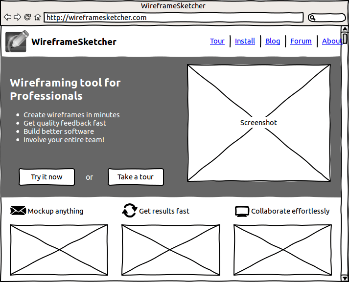

# Exercise 3 : Agile Delivery

This exercise intends to address the need of a client.

## Step 1 : The client's mockup

Your brand new client has a great a product to sell but requires a website for it.
He has already created a mockup and would like you to create the homepage of his dreams :

## Step 2 : The job

- Create an index.html file with boostrap
- Create a custom sass file and override values to offer a unique design to your client
- Feel free to integrate cool libraries and icons
- Pay attention to color design and accessibility
- [Useful tool 1 ](https://material.io/resources/color/#!/?view.left=0&view.right=0)
- [Useful tool 2 ](https://www.sessions.edu/color-calculator/)

## Step 3 : Thinking

- Think up about how we could speed up the development
- Think also about what are the drawbacks of using Bootstrap and Sass
